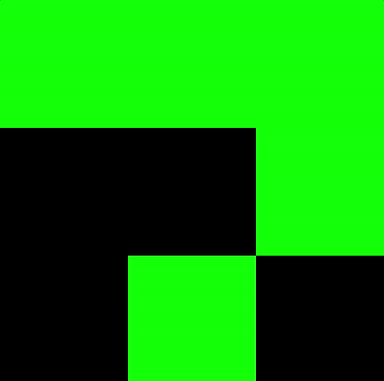

# gym-forage

A foraging environment for OpenAI Gym.


### game mechanics

You're an agent in a 2D grid. Some of the cells in the grid have
resources, and others are empty. You need to move around and collect
food in order to survive. With each step, your energy level (i.e. resources
accumulated so far) will go down by some constant factor. Even if
you stay still, each step in the gym environment will deduct some
(smaller than if you make a move) amount from your accumulated resources.

You do not have perfect information. You can only see the cells that are
immediately surrounding you (POMDP's ftw).

For example, your immediate surroundings might look something like this (agent is in the
center cell):

```
|0|1|0|
|0|0|0|
|1|0|0|
```

There are 9 different actions you can take. They're shown with their action numbers here. Taking
action N means you will move into that cell:

```
|0|1|2|
|3|4|5|
|6|7|8|
```

Taking action 4 means you stay in your current spot. After you visit a spot, its resources are consumed.


Your score = (# steps) * (accumulated resources)

#### example
Agent taking random actions in a grid filled using a binomial distribution function to distribute resources in the state space:



The green squares contain food, black are empty, and red is the edge of the grid.
